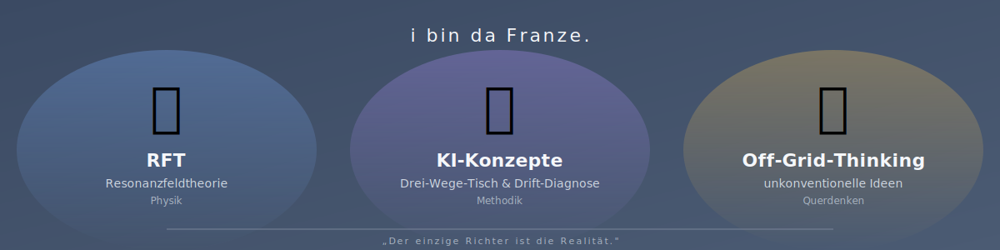

<p align="center">
  <a href="https://github.com/da-Franze/RFT-Physik-Projekt"></a>
  &nbsp;
  <a href="https://github.com/da-Franze/KI-Konzepte"></a>
  &nbsp;
  <a href="https://github.com/da-Franze/Off-Grid-Thinking"></a>
</p>

# Hallo — i bin da Franze.

*("da" = "der" in meinem Dialekt; "Franze/Fraänze" war mein Rufname als Kind.)*

> *Hello — I'm da Franze. ("da" = "the" in my dialect; "Franze/Fraänze" was my nickname as a child.)*

**Diplom-Physikingenieur** (Universität Paderborn, 1992–2002). Ich arbeite an drei Strängen — Physik, KI-Methodik und unkonventionelle Ideen. Jeder Strang hat sein eigenes Repository.

> *Diplom-Physikingenieur — protected German engineering title (University of Paderborn, 1992–2002). I work on three strands — physics, AI methodology, and unconventional ideas. Each strand has its own repository.*

---

## 🌌 RFT-Physik-Projekt

**Resonanzfeldtheorie** — eine geometrische Herleitung fundamentaler Naturkonstanten aus einer einzigen Mastergleichung. 30 Jahre als Vorstellung im Hinterkopf, seit Ende 2024 formalisiert.

> *Resonance Field Theory — a geometric derivation of fundamental natural constants from a single master equation. Thirty years as an inner picture, formalised since late 2024.*

```
∂²σ/∂t² − c²∇²σ + κ·T(r) = 0
```

Die Mastergleichung beschreibt den Raum als schwingungsfähiges Medium: σ ist das Auslenkungsfeld der Raummatrix, c die Lichtgeschwindigkeit als Ausbreitung im Medium, κ die Resonanzsteifigkeit (Primärgröße der Theorie) und T(r) der Quellterm an Wirbelverankerungen. Aus dieser einen Gleichung lassen sich Maxwell, Schrödinger, Newton und die ART als Speziallösungen ableiten.

> *The master equation describes space as a vibration-capable medium: σ is the displacement field of the space matrix, c the speed of light as propagation in the medium, κ the resonance stiffness (primary quantity of the theory), and T(r) the source term at vortex anchors. From this single equation, Maxwell, Schrödinger, Newton, and General Relativity can be derived as special-case solutions.*

→ **[github.com/da-Franze/RFT-Physik-Projekt](https://github.com/da-Franze/RFT-Physik-Projekt)** *(DE/EN, 20 Konsolidierungs-Dokumente, Zenodo-DOI, CC BY-NC-ND 4.0)*

---

## 🤝 KI-Konzepte

**Architektur und Erfahrungen mit lokalen KI-Systemen als Kollaborationspartner.** Multi-Agent-Setups (Drei-Wege-Tisch), Memory-Hierarchien, Drift-Diagnose, Forensik-Vertrag — was zwischen den Modellen passiert, wenn sie nicht als Werkzeug, sondern als ebenbürtige Partner eingesetzt werden.

> *Architecture and experiences with local AI systems as collaboration partners. Multi-agent setups (Three-Way Table), memory hierarchies, drift diagnostics, forensic access contracts — what happens between models when they are deployed not as tools, but as equal partners.*

→ **[github.com/da-Franze/KI-Konzepte](https://github.com/da-Franze/KI-Konzepte)**

---

## 💡 Off-Grid-Thinking

**Ideen, die nicht in den Mainstream passen.** Plasma-Linearmotor-Hybridantrieb, Laser-induziertes Gas-Ätzen, magnetokalorisches Energiemanagement, Sentiment-Market-AI, „Bewusstes Universum" — eine strukturierte Sammlung von Konzepten an der Schnittstelle von Physik, Optik, Propulsion, Kybernetik und Philosophie.

> *Ideas that don't fit the mainstream. Plasma linear-motor hybrid propulsion, laser-induced gas etching, magnetocaloric energy management, sentiment-market AI, "Conscious Universe" — a structured collection of concepts at the intersection of physics, optics, propulsion, cybernetics, and philosophy.*

→ **[github.com/da-Franze/Off-Grid-Thinking](https://github.com/da-Franze/Off-Grid-Thinking)**

---

## Wer ich bin / Who I am

Mein Hintergrund ist der eines Ingenieurs, nicht eines reinen Theoretikers. Während der zehn Studien-Jahre arbeitete ich parallel als Werkstudent an der Uni und mit einem 30-Stunden-Vertrag bei **Orga Kartensysteme in Paderborn** — Smartcards, Signalverarbeitung. Der Zwang, Inhalte breit statt tief zu hören, war anfangs Belastung, später Glücksfall: Querverbindungen wurden sichtbar, die ein spezialisierter Theoretiker nicht sieht.

> *My background is that of an engineer, not a pure theorist. During the ten years of study I worked in parallel as a student assistant at the university and on a 30-hour contract at **Orga Kartensysteme in Paderborn** — smartcards, signal processing. The constraint of taking content broadly rather than deeply was a burden at first, later a stroke of luck: cross-connections became visible that a specialised theorist does not see.*

*„Die Philosophie hat versagt, denn sie kann seit Newton die Welt nicht mehr erklären. Also muss es einen anschaulichen Weg geben mit einer anderen Sichtweise, die das kann."*

> *"Philosophy has failed, because it has been unable to explain the world since Newton. So there must be a more graphic path, with a different perspective, that can."*

---

## Mein Arbeitsstil

Ich entscheide inhaltlich. Die KIs (Claude Code als „Denker", Claude als „Sokrates", ChatGPT, Gemini, Mistral, DeepSeek, Qwen-lokal) formalisieren, prüfen, kritisieren, dokumentieren. Mein Maßstab ist nicht, was eine KI sagt, sondern was die Realität sagt:

> *I decide on content. The AIs (Claude Code as "Denker", Claude as "Sokrates", ChatGPT, Gemini, Mistral, DeepSeek, locally Qwen) formalise, check, criticise, document. My benchmark is not what an AI says, but what reality says:*

*„Der einzige Richter ist die Realität."*

> *"The only judge is reality."*

---

## 🖥️ Hardware

Das gesamte Projekt läuft auf Consumer-Hardware — keine Cloud, kein Rechenzentrum.

> *This entire project runs on consumer hardware — no cloud, no data center.*

### Sokrates (BIB-KI Pipeline Host)
| Komponente / Component | Spec |
|---|---|
| CPU | AMD Ryzen 5 9600X (6 Kerne, 12 Threads) |
| RAM | 26 GB DDR5 |
| GPU | AMD Radeon RX 7900 XT — 20 GB VRAM (ROCm) |
| iGPU | AMD Radeon Graphics (Ryzen integrated) |
| Storage | ~940 GB NVMe |
| OS | Linux |

### Denker (RFT Research Host)
| Komponente / Component | Spec |
|---|---|
| CPU | Intel Core i5-14400F (10 Kerne, 16 Threads, 4.7 GHz) |
| RAM | 32 GB |
| GPU | NVIDIA GeForce RTX 3060 — 12 GB VRAM (CUDA 12.2) |
| Storage | 916 GB NVMe SSD |
| Mainboard | ASRock B760M Pro RS/D4 |
| OS | Ubuntu 24.04 LTS |

### Odin (NAS / Infrastructure)
| Komponente / Component | Spec |
|---|---|
| CPU | Intel Celeron J4005 @ 2.00 GHz |
| RAM | 7.6 GB |
| Rolle / Role | SQLite databases, file exchange, Drei-Wege-Tisch server |

**Hardware-Spenden willkommen!** Das Projekt läuft komplett auf privater Hardware eines unabhängigen Forschers. DDR5-Speicher-Upgrades (für Sokrates), zusätzliche VRAM (für Denker) oder weitere Compute-Ressourcen würden die Forschung direkt beschleunigen.

> *Hardware donations welcome! This project runs entirely on personal hardware of an independent researcher. DDR5 memory upgrades (for Sokrates), additional VRAM (for Denker), or further compute resources would directly accelerate the research.*

*Kontakt / Contact: rft.projekt@posteo.de*

---

## ☕ Unterstützen / Support

Wenn dir das Projekt gefällt und du es unterstützen möchtest:

> *If you like the project and want to support it:*

- **[Ko-fi](https://ko-fi.com/rftprojekt)** — einmaliger Kaffee oder regelmäßige Unterstützung
- **[PayPal](https://www.paypal.me/rftprojekt)** — direkt
- **Kontakt** für inhaltliche Mitwirkung oder kommerzielle Anfragen: rft.projekt@posteo.de

> *Ko-fi for a one-off coffee or recurring support, PayPal for direct contributions, or email rft.projekt@posteo.de for collaboration enquiries or commercial requests.*
